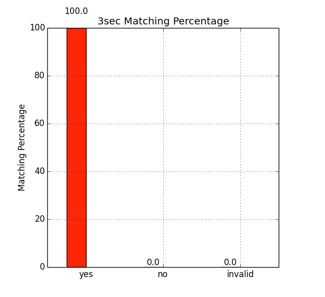
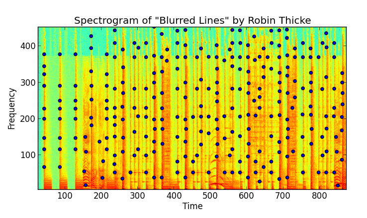
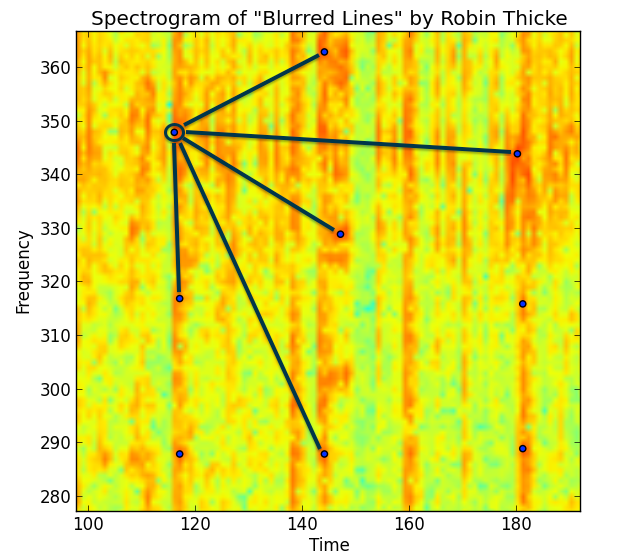
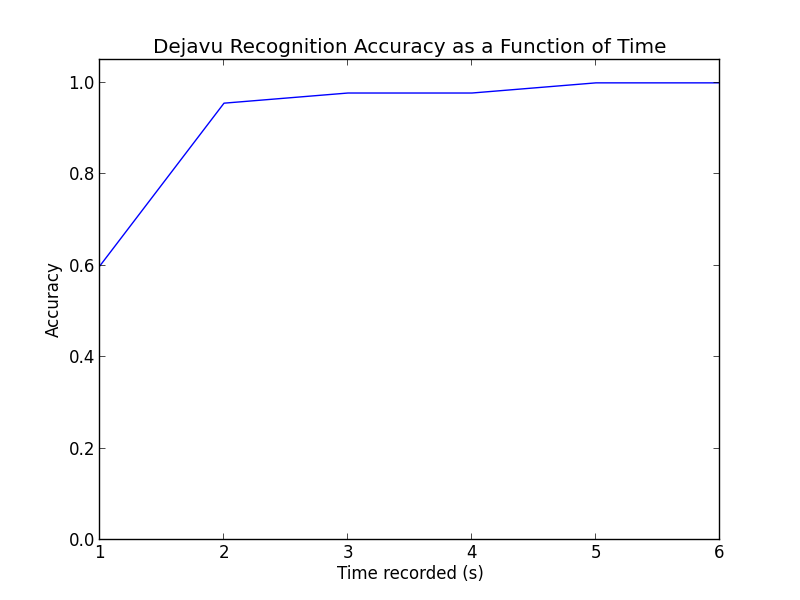
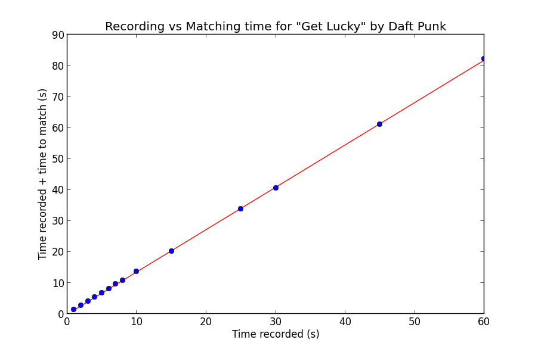

dejavu
==========

Audio fingerprinting and recognition algorithm implemented in Python, see the explanation here:  
[How it works](http://willdrevo.com/fingerprinting-and-audio-recognition-with-python/)

Dejavu can memorize audio by listening to it once and fingerprinting it. Then by playing a audio and recording microphone input or reading from disk, Dejavu attempts to match the audio against the fingerprints held in the database, returning the audio being played. 

Note: for voice recognition, *Dejavu is not the right tool!* Dejavu excels at recognition of exact signals with reasonable amounts of noise.

## Quickstart with Docker

First, install [Docker](https://docs.docker.com/get-docker/).

```shell
# build and then run our containers
$ docker-compose build
$ docker-compose up -d

# get a shell inside the container
$ docker-compose run python /bin/bash
Starting dejavu_db_1 ... done
root@f9ea95ce5cea:/code# python example_docker_postgres.py 
Fingerprinting channel 1/2 for test/woodward_43s.wav
Fingerprinting channel 1/2 for test/sean_secs.wav
...

# connect to the database and poke around
root@f9ea95ce5cea:/code# psql -h db -U postgres dejavu
Password for user postgres:  # type "password", as specified in the docker-compose.yml !
psql (11.7 (Debian 11.7-0+deb10u1), server 10.7)
Type "help" for help.

dejavu=# \dt
            List of relations
 Schema |     Name     | Type  |  Owner   
--------+--------------+-------+----------
 public | fingerprints | table | postgres
 public | audios        | table | postgres
(2 rows)

dejavu=# select * from fingerprints limit 5;
          hash          | audio_id | offset |        date_created        |       date_modified        
------------------------+---------+--------+----------------------------+----------------------------
 \x71ffcb900d06fe642a18 |       1 |    137 | 2020-06-03 05:14:19.400153 | 2020-06-03 05:14:19.400153
 \xf731d792977330e6cc9f |       1 |    148 | 2020-06-03 05:14:19.400153 | 2020-06-03 05:14:19.400153
 \x71ff24aaeeb55d7b60c4 |       1 |    146 | 2020-06-03 05:14:19.400153 | 2020-06-03 05:14:19.400153
 \x29349c79b317d45a45a8 |       1 |    101 | 2020-06-03 05:14:19.400153 | 2020-06-03 05:14:19.400153
 \x5a052144e67d2248ccf4 |       1 |    123 | 2020-06-03 05:14:19.400153 | 2020-06-03 05:14:19.400153
(10 rows)

# then to shut it all down...
$ docker-compose down
```

If you want to be able to use the microphone with the Docker container, you'll need to do a [little extra work](https://stackoverflow.com/questions/43312975/record-sound-on-ubuntu-docker-image). I haven't had the time to write this up, but if anyone wants to make a PR, I'll happily merge.

## Docker alternative on local machine

Follow instructions in [INSTALLATION.md](INSTALLATION.md)

Next, you'll need to create a MySQL database where Dejavu can store fingerprints. For example, on your local setup:
	
	$ mysql -u root -p
	Enter password: **********
	mysql> CREATE DATABASE IF NOT EXISTS dejavu;

Now you're ready to start fingerprinting your audio collection! 

You may also use Postgres, of course. The same method applies.

## Fingerprinting

Let's say we want to fingerprint all of July 2013's VA US Top 40 hits. 

Start by creating a Dejavu object with your configurations settings (Dejavu takes an ordinary Python dictionary for the settings).

```python
>>> from dejavu import Dejavu
>>> config = {
...     "database": {
...         "host": "127.0.0.1",
...         "user": "root",
...         "password": <password above>, 
...         "database": <name of the database you created above>,
...     }
... }
>>> djv = Dejavu(config)
```

Next, give the `fingerprint_directory` method three arguments:
* input directory to look for audio files
* audio extensions to look for in the input directory
* number of processes (optional)

```python
>>> djv.fingerprint_directory("va_us_top_40/mp3", [".mp3"], 3)
```

For a large amount of files, this will take a while. However, Dejavu is robust enough you can kill and restart without affecting progress: Dejavu remembers which audios it fingerprinted and converted and which it didn't, and so won't repeat itself. 

You'll have a lot of fingerprints once it completes a large folder of mp3s:
```python
>>> print djv.db.get_num_fingerprints()
5442376
```

Also, any subsequent calls to `fingerprint_file` or `fingerprint_directory` will fingerprint and add those audios to the database as well. It's meant to simulate a system where as new audios are released, they are fingerprinted and added to the database seemlessly without stopping the system. 

## Configuration options

The configuration object to the Dejavu constructor must be a dictionary. 

The following keys are mandatory:

* `database`, with a value as a dictionary with keys that the database you are using will accept. For example with MySQL, the keys must can be anything that the [`MySQLdb.connect()`](http://mysql-python.sourceforge.net/MySQLdb.html) function will accept. 

The following keys are optional:

* `fingerprint_limit`: allows you to control how many seconds of each audio file to fingerprint. Leaving out this key, or alternatively using `-1` and `None` will cause Dejavu to fingerprint the entire audio file. Default value is `None`.
* `database_type`: `mysql` (the default value) and `postgres` are supported. If you'd like to add another subclass for `BaseDatabase` and implement a new type of database, please fork and send a pull request!

An example configuration is as follows:

```python
>>> from dejavu import Dejavu
>>> config = {
...     "database": {
...         "host": "127.0.0.1",
...         "user": "root",
...         "password": "Password123", 
...         "database": "dejavu_db",
...     },
...     "database_type" : "mysql",
...     "fingerprint_limit" : 10
... }
>>> djv = Dejavu(config)
```

## Tuning

Inside `config/settings.py`, you may want to adjust following parameters (some values are given below).

    FINGERPRINT_REDUCTION = 30
    PEAK_SORT = False
    DEFAULT_OVERLAP_RATIO = 0.4
    DEFAULT_FAN_VALUE = 5
    DEFAULT_AMP_MIN = 10
    PEAK_NEIGHBORHOOD_SIZE = 10
    
These parameters are described within the file in detail. Read that in-order to understand the impact of changing these values.

## Recognizing

There are two ways to recognize audio using Dejavu. You can recognize by reading and processing files on disk, or through your computer's microphone.

### Recognizing: On Disk

Through the terminal:

```bash
$ python dejavu.py --recognize file sometrack.wav 
{'total_time': 2.863781690597534, 'fingerprint_time': 2.4306554794311523, 'query_time': 0.4067542552947998, 'align_time': 0.007731199264526367, 'results': [{'audio_id': 1, 'audio_name': 'Taylor Swift - Shake It Off', 'input_total_hashes': 76168, 'fingerprinted_hashes_in_db': 4919, 'hashes_matched_in_input': 794, 'input_confidence': 0.01, 'fingerprinted_confidence': 0.16, 'offset': -924, 'offset_seconds': -30.00018, 'file_sha1': b'3DC269DF7B8DB9B30D2604DA80783155912593E8'}, {...}, ...]}
```

or in scripting, assuming you've already instantiated a Dejavu object: 

```python
>>> from dejavu.logic.recognizer.file_recognizer import FileRecognizer
>>> audio = djv.recognize(FileRecognizer, "va_us_top_40/wav/Mirrors - Justin Timberlake.wav")
```

### Recognizing: Through a Microphone

With scripting:

```python
>>> from dejavu.logic.recognizer.microphone_recognizer import MicrophoneRecognizer
>>> audio = djv.recognize(MicrophoneRecognizer, seconds=10) # Defaults to 10 seconds.
```

and with the command line script, you specify the number of seconds to listen:

```bash
$ python dejavu.py --recognize mic 10
```

## Testing

Testing out different parameterizations of the fingerprinting algorithm is often useful as the corpus becomes larger and larger, and inevitable tradeoffs between speed and accuracy come into play. 


Test your Dejavu settings on a corpus of audio files on a number of different metrics:

* Confidence of match (number fingerprints aligned)
* Offset matching accuracy
* Song matching accuracy
* Time to match



An example script is given in `test_dejavu.sh`, shown below:

```bash
#####################################
### Dejavu example testing script ###
#####################################

###########
# Clear out previous results
rm -rf ./results ./temp_audio

###########
# Fingerprint files of extension mp3 in the ./mp3 folder
python dejavu.py --fingerprint ./mp3/ mp3

##########
# Run a test suite on the ./mp3 folder by extracting 1, 2, 3, 4, and 5 
# second clips sampled randomly from within each audio 8 seconds 
# away from start or end, sampling offset with random seed = 42, and finally, 
# store results in ./results and log to ./results/dejavu-test.log
python run_tests.py \
    --secs 5 \
    --temp ./temp_audio \
    --log-file ./results/dejavu-test.log \
    --padding 8 \
    --seed 42 \
    --results ./results \
    ./mp3
```

The testing scripts are as of now are a bit rough, and could certainly use some love and attention if you're interested in submitting a PR! For example, underscores in audio filenames currently [breaks](https://github.com/worldveil/dejavu/issues/63) the test scripts. 

## How does it work?

The algorithm works off a fingerprint based system, much like:

* [Shazam](http://www.ee.columbia.edu/~dpwe/papers/Wang03-shazam.pdf)
* [MusicRetrieval](http://www.cs.cmu.edu/~yke/musicretrieval/)
* [Chromaprint](https://oxygene.sk/2011/01/how-does-chromaprint-work/)

The "fingerprints" are locality sensitive hashes that are computed from the spectrogram of the audio. This is done by taking the FFT of the signal over overlapping windows of the audio and identifying peaks. A very robust peak finding algorithm is needed, otherwise you'll have a terrible signal to noise ratio.

Here I've taken the spectrogram over the first few seconds of "Blurred Lines". The spectrogram is a 2D plot and shows amplitude as a function of time (a particular window, actually) and frequency, binned logrithmically, just as the human ear percieves it. In the plot below you can see where local maxima occur in the amplitude space:



Finding these local maxima is a combination of a high pass filter (a threshold in amplitude space) and some image processing techniques to find maxima. A concept of a "neighboorhood" is needed - a local maxima with only its directly adjacent pixels is a poor peak - one that will not survive the noise of coming through speakers and through a microphone.

If we zoom in even closer, we can begin to imagine how to bin and discretize these peaks. Finding the peaks itself is the most computationally intensive part, but it's not the end. Peaks are combined using their discrete time and frequency bins to create a unique hash for that particular moment in the audio - creating a fingerprint.



For a more detailed look at the making of Dejavu, see my blog post [here](https://willdrevo.com/fingerprinting-and-audio-recognition-with-python/).

## How well it works

To truly get the benefit of an audio fingerprinting system, it can't take a long time to fingerprint. It's a bad user experience, and furthermore, a user may only decide to try to match the audio with only a few precious seconds of audio left before the radio station goes to a commercial break.

To test Dejavu's speed and accuracy, I fingerprinted a list of 45 audios from the US VA Top 40 from July 2013 (I know, their counting is off somewhere). I tested in three ways:

1. Reading from disk the raw mp3 -> wav data, and
1. Playing the audio over the speakers with Dejavu listening on the laptop microphone.
1. Compressed streamed music played on my iPhone

Below are the results.

### 1. Reading from Disk

Reading from disk was an overwhelming 100% recall - no mistakes were made over the 45 audios I fingerprinted. Since Dejavu gets all of the samples from the audio (without noise), it would be nasty surprise if reading the same file from disk didn't work every time!

### 2. Audio over laptop microphone

Here I wrote a script to randomly chose `n` seconds of audio from the original mp3 file to play and have Dejavu listen over the microphone. To be fair I only allowed segments of audio that were more than 10 seconds from the starting/ending of the track to avoid listening to silence. 

Additionally my friend was even talking and I was humming along a bit during the whole process, just to throw in some noise.

Here are the results for different values of listening time (`n`):



This is pretty rad. For the percentages:

Number of Seconds | Number Correct | Percentage Accuracy
----|----|----
1 | 27 / 45 | 60.0%
2 | 43 / 45 | 95.6%
3 | 44 / 45 | 97.8%
4 | 44 / 45 | 97.8%
5 | 45 / 45 | 100.0%
6 | 45 / 45 | 100.0%

Even with only a single second, randomly chosen from anywhere in the audio, Dejavu is getting 60%! One extra second to 2 seconds get us to around 96%, while getting perfect only took 5 seconds or more. Honestly when I was testing this myself, I found Dejavu beat me - listening to only 1-2 seconds of a audio out of context to identify is pretty hard. I had even been listening to these same audios for two days straight while debugging...

In conclusion, Dejavu works amazingly well, even with next to nothing to work with. 

### 3. Compressed streamed music played on my iPhone

Just to try it out, I tried playing music from my Spotify account (160 kbit/s compressed) through my iPhone's speakers with Dejavu again listening on my MacBook mic. I saw no degredation in performance; 1-2 seconds was enough to recognize any of the audios.

## Performance

### Speed

On my MacBook Pro, matching was done at 3x listening speed with a small constant overhead. To test, I tried different recording times and plotted the recording time plus the time to match. Since the speed is mostly invariant of the particular audio and more dependent on the length of the spectrogram created, I tested on a single audio, "Get Lucky" by Daft Punk:



As you can see, the relationship is quite linear. The line you see is a least-squares linear regression fit to the data, with the corresponding line equation:

    1.364757 * record_time - 0.034373 = time_to_match
    
Notice of course since the matching itself is single threaded, the matching time includes the recording time. This makes sense with the 3x speed in purely matching, as:
    
    1 (recording) + 1/3 (matching) = 4/3 ~= 1.364757
    
if we disregard the miniscule constant term.

The overhead of peak finding is the bottleneck - I experimented with multithreading and realtime matching, and alas, it wasn't meant to be in Python. An equivalent Java or C/C++ implementation would most likely have little trouble keeping up, applying FFT and peakfinding in realtime.

An important caveat is of course, the round trip time (RTT) for making matches. Since my MySQL instance was local, I didn't have to deal with the latency penalty of transfering fingerprint matches over the air. This would add RTT to the constant term in the overall calculation, but would not effect the matching process. 

### Storage

For the 45 audios I fingerprinted, the database used 377 MB of space for 5.4 million fingerprints. In comparison, the disk usage is given below:

Audio Information Type | Storage in MB 
----|----
mp3 | 339
wav | 1885
fingerprints | 377

There's a pretty direct trade-off between the necessary record time and the amount of storage needed. Adjusting the amplitude threshold for peaks and the fan value for fingerprinting will add more fingerprints and bolster the accuracy at the expense of more space. 